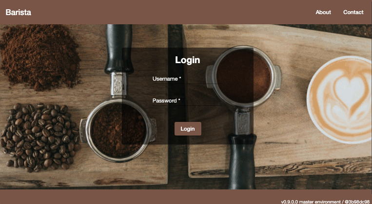
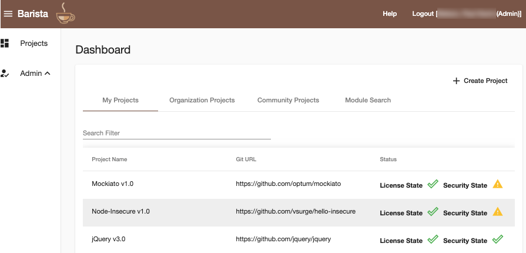
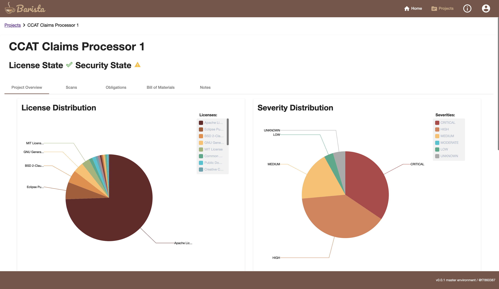
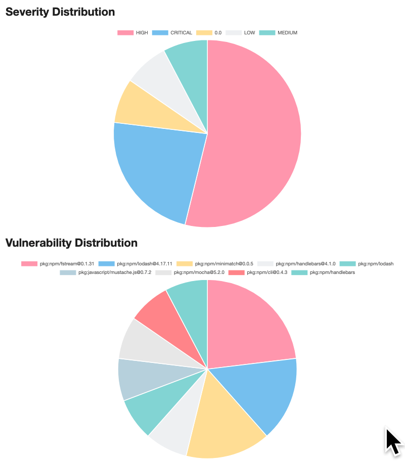
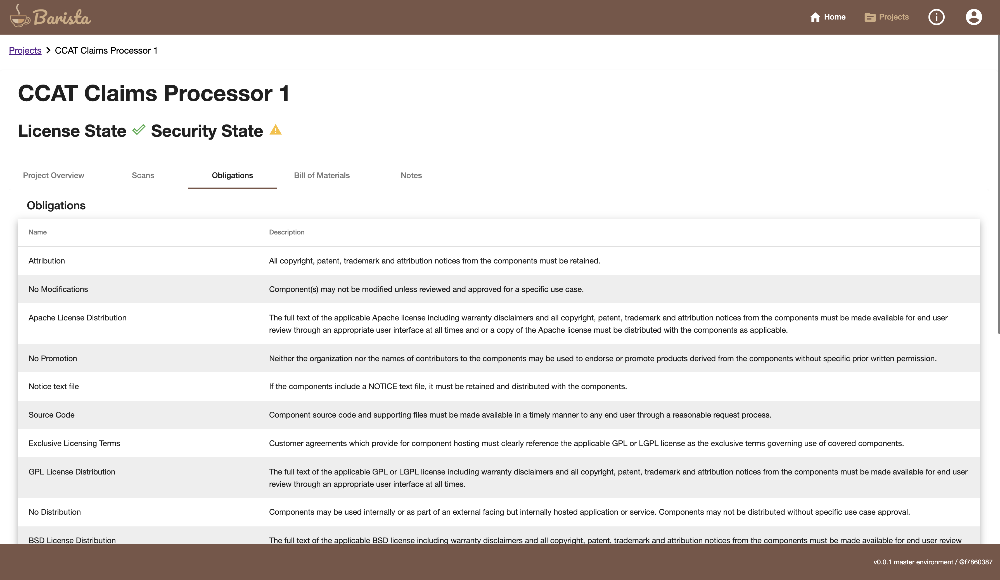

# Barista 

Project Barista is a developer focused, cloud native, pure open source solution for open source license and vulnerability management.  

Project goals include but are not limited to:

1. maintain a license inventory system of record per project/service/product for OSS consumption within an organization
1. automate license impact analysis related to OSS consumption
1. automate publisher attribution analysis related to OSS consumption
1. automate OSS vulnerability scanning

Barista allows a developer to set up their project for scanning from any Git compatible repo.  Once a scan is initiated, the project is processed as follows:

1. The repo is cloned into a temporary directory.  All contents will be destroyed once processing is finished.
1. License scanning is initiated.  Barista currently supports the following technology stacks:
    1. Java using the Maven package manager
    2. .Net using the NuGet package manager
    3. Node using the NPM package manager
    4. Python using the PIP package manager
    - Support for additional package managers are on the roadmap as the community evolves e.g. Gradle, Go

1.  Each technology stack uses native tools to gather project dependencies with as much meta data as can be harvested e.g. license, publisher information and or the project's published URL
1. Unsupported technology stacks can be scanned using the [nexB/scancode-tool](https://github.com/nexB/scancode-toolkit) but results are not as comprehensive and performance is degraded.
1. All project and dependency code is then run through the [OWASP Dependency Check tool](https://github.com/jeremylong/DependencyCheck) to gather published vulnerability information.
1. Both license and vulnerability findings are then run through a set of  user defined business rules which allow categorization of findings into 1 of 3 categories:
  -  Approved
  -  Warning
  -  Disapproved

## Sample Screen Shots

### Login Page

### Dashboard

### Project Summary Licenses

### Project Summary Vulnerabilities

### Project Obligations

## Join our growing community!

Start with our [developer documentation](./doc/README.md).
