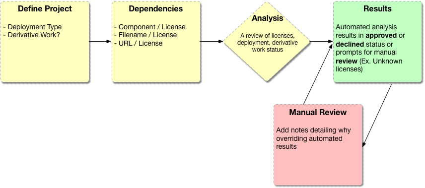

# Workflow

## Diagram

## Input

Barista offers flexible options depending on the requirements of the Project and owners.

### Passive Scanning

With **Passive Scanning** we can slurp in some or all of the Projects found on GHE. There will be either a "whitelist", a "blacklist", or a mixture of both to gradually ramp up this form of License Scanning.

### On Demand

If Project owners wish to utilize the Barista License Scanning Workflow at their own pace, we support that use case. First, there is a **[ Scan Now ]** button provided in the UI. Second, outside of the provided UI, a License Scan can be initiated via API. This option is what supports Projects that wish to use Barista within their Jenkins pipeline or those that want a way to customize their own workflow.

### Upload

A third option for Projects where source code is not accessible to Barista (either because of not being on GHE, certain privacy/security restrictions, etc). A requirement for each scan will be a tarball upload of the source code.

### Manual

This capability exists primarily for our Desktop Support teams that register FOSS tools (Ex. Atom code editor or a dependency on the Mongo datastore). After manually registering the Project, options exist for uploading source code and linking to an external source code repository.

#### Needs further exploration

- Filtering **Passive Scanning** based on criteria (Ex. by Org, by Owner, by last commit date)
- Barista config file at the root of the repository containing metadata (Ex. type of deployment, type of project, derivative work declaration, etc)
- Ability to "opt out" of License Scans altogether

## Status

Overall project status is determined after project definition, license scan of dependencies, and manual registration of components.

- Approved
- Declined
- Review

## Obligations

TBD
